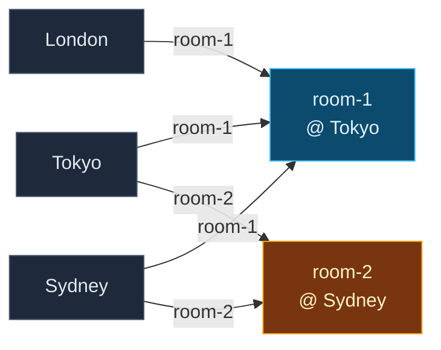
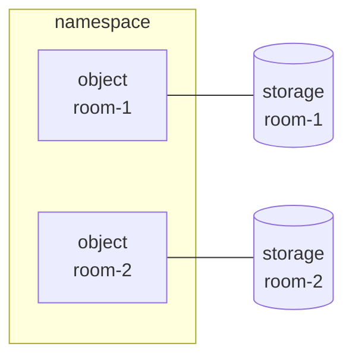
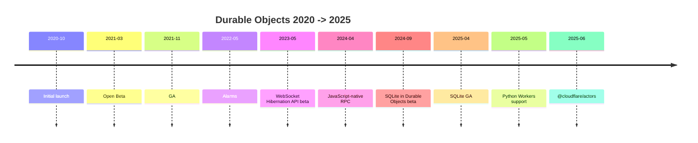
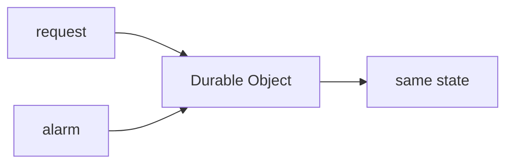
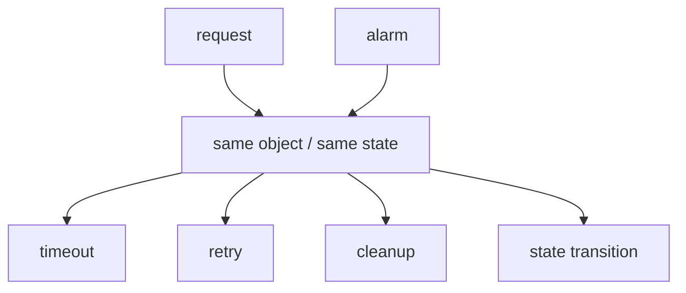

<style>
.slidev-layout {
  --deck-bg-warm: rgba(245, 158, 11, 0.14);
  --deck-bg-cool: rgba(59, 130, 246, 0.12);
  --deck-text-main: rgb(24 24 27);
  --deck-text-muted: rgb(82 82 91);
  --deck-text-soft: rgb(113 113 122);
  --deck-surface: rgba(255, 255, 255, 0.58);
  --deck-surface-strong: rgba(255, 255, 255, 0.72);
  --deck-surface-border: rgba(228, 228, 231, 0.7);
  --deck-link: rgb(180 83 9);
  --deck-accent: rgb(180 83 9);
  position: relative;
  padding-bottom: 3.5rem;
}

.slidev-layout {
  background:
    radial-gradient(circle at 85% 18%, var(--deck-bg-warm), transparent 20rem),
    radial-gradient(circle at 14% 86%, var(--deck-bg-cool), transparent 18rem);
}

.dark .slidev-layout {
  --deck-bg-warm: rgba(251, 191, 36, 0.12);
  --deck-bg-cool: rgba(96, 165, 250, 0.1);
  --deck-text-main: rgb(244 244 245);
  --deck-text-muted: rgb(212 212 216);
  --deck-text-soft: rgb(161 161 170);
  --deck-surface: rgba(24, 24, 27, 0.5);
  --deck-surface-strong: rgba(24, 24, 27, 0.72);
  --deck-surface-border: rgba(63, 63, 70, 0.85);
  --deck-link: rgb(252 211 77);
  --deck-accent: rgb(252 211 77);
  background:
    radial-gradient(circle at 85% 18%, var(--deck-bg-warm), transparent 20rem),
    radial-gradient(circle at 14% 86%, var(--deck-bg-cool), transparent 18rem);
}

.slidev-layout .font-semibold {
  color: var(--deck-accent);
}

.mermaid {
  display: flex;
  justify-content: center;
  align-items: center;
}
</style>

# Durable Objects 2026

<CoverHero />


---

# Durable Objects とは

<div class="mt-8 text-[1.08rem] leading-8">
  Durable Objects は
  <span class="font-semibold">name に紐づく instance として state を持ち続ける</span>
  実行単位
</div>

<div class="mt-8 grid grid-cols-[1fr_auto_1fr] gap-5 items-stretch">
  <div>
    <div class="mb-3 inline-block px-3 py-1 rounded-full bg-zinc-800/60 border border-zinc-700/60 text-[0.72rem] uppercase tracking-[0.22em] text-zinc-400">stateless · 揮発</div>
    <InfoCard
      title="Worker"
      icon="/assets/cloudflare-workers.svg"
      icon-alt="Cloudflare Workers"
    >
      <BulletList>
        <li>request ごとに起動 → 処理 → 消える</li>
        <li>memory は揮発、state は外部 (KV / D1 / DB) へ出す</li>
        <li>水平スケールに強い</li>
        <li>特定 client / room を追跡する処理は書きにくい</li>
      </BulletList>
    </InfoCard>
  </div>
  <div class="flex flex-col items-center justify-center gap-1 pt-10 min-w-[6rem]">
    <div class="text-[0.68rem] uppercase tracking-[0.25em] text-amber-400/80">invoke</div>
    <div class="text-amber-300 text-3xl leading-none">→</div>
    <div class="text-[0.68rem] uppercase tracking-[0.25em] text-amber-400/80">create</div>
  </div>
  <div>
    <div class="mb-3 inline-block px-3 py-1 rounded-full bg-amber-950/30 border border-amber-600/60 text-[0.72rem] uppercase tracking-[0.22em] text-amber-300">stateful · 持続</div>
    <InfoCard
      title="Durable Object"
      icon="/assets/cloudflare-durable-objects.svg"
      icon-alt="Cloudflare Durable Objects"
    >
      <BulletList>
        <li>同じ name を指すと <span class="font-semibold">同じ instance</span> に routing される</li>
        <li>object ごとに <span class="font-semibold">private な durable storage</span> を持つ</li>
        <li>チャット room / rate limiter / realtime collab など状態を持つ処理を object 単位で書ける</li>
      </BulletList>
    </InfoCard>
  </div>
</div>

---

# 同じ name は同じ object に対応する

<div class="mt-4 text-[1.05rem] leading-7 text-zinc-700 dark:text-zinc-200">
  同じ <code>name</code> で呼ぶと <span class="font-semibold">毎回同じ instance</span> に繋がり、別の <code>name</code> なら別 instance に分かれる
</div>

<div class="mt-6">

</div>

<div class="mt-8 text-[1rem] leading-7 text-zinc-700 dark:text-zinc-200">
  <span class="font-semibold">routing / state / 並行性の単位</span> がすべて object で揃う → 設計は <span class="font-semibold">name をどう切るか</span> に集中できる
</div>

---

# object ごとに隔離された durable storage を持てる

<div class="mt-8 grid grid-cols-[1.1fr_1fr] gap-10 items-center">
  <div>

  </div>
  <div class="space-y-3 text-[1rem] leading-8">
    <div>object ごとに <span class="font-semibold">専用の durable storage</span> が付く</div>
    <div>他の object からは <span class="font-semibold">見えない / 触れない</span></div>
    <div>instance が evict / hibernate されても storage は残る</div>
    <div>同じ name で呼び出せば <span class="font-semibold">同じ state に戻ってくる</span></div>
    <div>最初の <code>get()</code> で近い DC に配置され、以降は <span class="font-semibold">そのロケーションに pin</span> される</div>
  </div>
</div>

<div class="mt-10 text-[1.05rem] leading-8 text-zinc-700 dark:text-zinc-200">
  Durable Objects は
  <span class="font-semibold">routing / execution / storage</span>
  をすべて object 単位で束ねる仕組みです
</div>

---

# 年表で見る

<div class="mt-8 w-full">

</div>

<div class="mt-16 text-[1.5rem] text-zinc-700 dark:text-zinc-200 text-center">
  Durable Objects は
  <span class="font-semibold">どう強化されてきたか</span>
  を順を追って見ていきます
</div>

<SourceNote
  :sources="[
    { label: 'Cloudflare changelog', href: 'https://developers.cloudflare.com/changelog/product/durable-objects/' },
  ]"
/>


---

# 2020-10 → 2021-11 GA: 初期の Durable Objects

<div class="flex items-center gap-8">
<div class="mt-8 flex flex-col gap-8">
  <InfoCard title="初期の class / instance / stub">
    <BulletList>
      <li>class で Durable Object を定義する</li>
      <li>id / name ごとに instance がある</li>
      <li>stub からその object を呼ぶ</li>
    </BulletList>
  </InfoCard>
  <InfoCard title="初期の永続化 API">
    <BulletList>
      <li>storage に KV <code>get</code> / <code>put</code> で IO</li>
      <li>object ごとに独立して永続化される</li>
    </BulletList>
  </InfoCard>
</div>

```ts
export class Counter {
  constructor(state, env) {
    this.state = state
  }

  async fetch(request) {
    let value = (await this.state.storage.get("value")) ?? 0
    value++
    await this.state.storage.put("value", value)
    return new Response(String(value))
  }
}

const id = env.COUNTER.idFromName("global")
const stub = env.COUNTER.get(id)
```

</div>

<div class="mt-4 text-[0.95rem] leading-7 text-zinc-700 dark:text-zinc-200">
  2021-11 GA で
  <span class="font-semibold">single-threaded / in-order / strongly consistent</span>
  が性質として明示される
</div>

<SourceNote
  :sources="[
    { label: 'launch blog', href: 'https://blog.cloudflare.com/introducing-workers-durable-objects/' },
    { label: 'open beta blog', href: 'https://blog.cloudflare.com/durable-objects-open-beta/' },
    { label: 'GA blog', href: 'https://blog.cloudflare.com/durable-objects-ga/' },
  ]"
/>

---

# 2022-05: Alarms — time-based な起動も可能に

<div class="mt-8 flex h-[calc(100%-5.5rem)] flex-col">
<div class="grid grid-cols-[1.1fr_1fr] gap-10 items-center">
  <div>

  </div>
  <div class="space-y-3 text-[1rem] leading-8">
    <div><span class="font-semibold">request</span> 以外に <span class="font-semibold">alarm</span> でも起動できる</div>
    <div>DO は time-based wakeup を持つ object になる</div>
    <div>同じ state に対する scheduled work を object 内に閉じ込められる</div>
  </div>
</div>

<div class="mt-6">
```ts
export class Session {
  async fetch() {
    await this.ctx.storage.setAlarm(Date.now() + 60_000)
    return new Response("scheduled")
  }

  async alarm() {
    // cleanup / retry
  }
}
```
</div>

<SourceNote
  :sources="[
    { label: 'alarms blog', href: 'https://blog.cloudflare.com/durable-objects-alarms/' },
  ]"
/>
</div>

---

# Alarms で何ができるようになったか

<div class="mt-8 grid grid-cols-[1.2fr_1fr] gap-10 items-center">
  <div>

  </div>
  <div class="space-y-4 text-[1rem] leading-8">
    <div>あとで起きる仕事を <span class="font-semibold">同じ object の責務</span> として書ける</div>
    <div>request が来た時だけ動く object ではなく、<span class="font-semibold">time-based wakeup を持つ object</span> になる</div>
  </div>
</div>

<div class="mt-8 text-[0.95rem] leading-7 text-zinc-700 dark:text-zinc-200">
  例: rate limiter のウィンドウリセット / idle session の自動クローズ / 予約通知 / retry with backoff / batch flush
</div>

<SourceNote
  :sources="[
    { label: 'alarms blog', href: 'https://blog.cloudflare.com/durable-objects-alarms/' },
  ]"
/>


---

# 2023-05: Hibernation で長時間 WS 接続を安く扱えるように

<div class="mt-4 text-[1.05rem] text-zinc-700 dark:text-zinc-200">
  <span class="font-semibold">connection lifetime</span> と
  <span class="font-semibold">execution lifetime</span>
  を切り離した API
</div>

<div class="mt-6 grid grid-cols-[1.35fr_1fr] gap-10 items-center">
  <div class="relative px-4 py-6 rounded-xl bg-zinc-900/40 border border-zinc-700/40">
    <div class="absolute right-4 top-2 text-[0.7rem] text-zinc-500">time →</div>
    <div class="flex items-center gap-3 mb-5">
      <div class="w-16 text-[0.8rem] text-zinc-400 text-right">client</div>
      <div class="flex-1 h-[3px] bg-sky-400 rounded-full"></div>
    </div>
    <div class="flex items-center gap-3 mb-5">
      <div class="w-16 text-[0.8rem] text-zinc-400 text-right">CF edge</div>
      <div class="flex-1 h-[3px] bg-sky-400 rounded-full"></div>
    </div>
    <div class="flex items-center gap-3 mb-2">
      <div class="w-16 text-[0.8rem] text-zinc-400 text-right">DO</div>
      <div class="flex-1 relative h-[3px]">
        <div class="absolute left-[0%] w-[10%] h-[3px] bg-amber-400 rounded-full"></div>
        <div class="absolute left-[35%] w-[6%] h-[3px] bg-amber-400 rounded-full"></div>
        <div class="absolute left-[70%] w-[6%] h-[3px] bg-amber-400 rounded-full"></div>
      </div>
    </div>
    <div class="flex items-center gap-3">
      <div class="w-16"></div>
      <div class="flex-1 relative text-[0.7rem] text-zinc-500 h-4">
        <div class="absolute left-[2%]">connect / accept</div>
        <div class="absolute left-[35%]">msg</div>
        <div class="absolute left-[70%]">msg</div>
      </div>
    </div>
    <div class="flex items-center gap-3 mt-2">
      <div class="w-16"></div>
      <div class="flex-1 relative text-[0.7rem] text-amber-300/70 h-4 italic">
        <div class="absolute left-[15%]">← evicted →</div>
        <div class="absolute left-[48%]">← evicted →</div>
      </div>
    </div>
  </div>
  <div class="space-y-3 text-[1rem] leading-7">
    <div>client / edge は <span class="font-semibold">ずっと接続</span></div>
    <div>DO は idle 時に <span class="font-semibold">memory から evict</span> される</div>
    <div>次の message で <code>webSocketMessage()</code> に wake</div>
    <div>接続単位の state は <code>ws.serializeAttachment()</code> で socket 側に持てる</div>
  </div>
</div>

<SourceNote
  :sources="[
    { label: 'ws docs', href: 'https://developers.cloudflare.com/durable-objects/best-practices/websockets/' },
    { label: 'hibernation api', href: 'https://developers.cloudflare.com/durable-objects/best-practices/websockets/#websocket-hibernation-api' },
  ]"
/>

---

# Hibernation が解いた制約

<div class="mt-4 text-[0.95rem] text-zinc-700 dark:text-zinc-200 whitespace-nowrap">
  <span class="font-semibold">CFW runtime が managed にソケット維持を引き受ける</span>
  → 開発者は <span class="font-semibold">コスト / 運用 / 実装</span> を意識しなくてよい
</div>

<div class="mt-6 grid grid-cols-2 gap-8">
  <SurfaceCard label="従来 (naive) の限界">
    <BulletList>
      <li>DO が <span class="font-semibold">全接続を memory に抱え続ける</span> 必要があった</li>
      <li>idle でも wall-clock で <span class="font-semibold">billable duration</span> が積まれる</li>
      <li>chat / presence / collab のような <span class="font-semibold">接続 ≫ 実行</span> のワークロードは DO であっても載せづらかった</li>
    </BulletList>
  </SurfaceCard>
  <SurfaceCard label="Hibernation 以降">
    <BulletList>
      <li>idle 時は <span class="font-semibold">billable duration が進まない</span></li>
      <li>メモリ占有量が <span class="font-semibold">active な message 量</span> に近づく</li>
      <li>数万接続を 1 object に束ねても成立する</li>
    </BulletList>
  </SurfaceCard>
</div>

<div class="mt-6 grid grid-cols-2 gap-6">
  <div>
    <div class="text-xs uppercase tracking-[0.18em] text-zinc-400 mb-1">Before: in-memory handler</div>
```ts
server.addEventListener("message", (msg) => {
  // closure は evict で消える
})
```
  </div>
  <div>
    <div class="text-xs uppercase tracking-[0.18em] text-zinc-400 mb-1">After: class method</div>
```ts
class Room extends DurableObject {
  async webSocketMessage(ws, msg) {
    // wake 後も同じ method が呼ばれる
  }
}
```
  </div>
</div>

<SourceNote
  :sources="[
    { label: 'ws docs', href: 'https://developers.cloudflare.com/durable-objects/best-practices/websockets/' },
    { label: 'lifecycle docs', href: 'https://developers.cloudflare.com/durable-objects/concepts/durable-object-lifecycle/' },
    { label: 'pricing docs', href: 'https://developers.cloudflare.com/durable-objects/platform/pricing/' },
    { label: 'acceptWebSocket api', href: 'https://developers.cloudflare.com/durable-objects/api/state/#acceptwebsocket' },
  ]"
/>

---

# 2024-04: RPC で DO を method call として呼べるように

<div class="mt-8 grid grid-cols-2 gap-8">
  <div>
    <div class="mb-3 text-sm uppercase tracking-[0.18em] text-zinc-500 dark:text-zinc-400">Before</div>
```ts
const id = env.ROOM.idFromName("general")
const stub = env.ROOM.get(id)

await stub.fetch("https://do/join", {
  method: "POST",
  body: JSON.stringify({ user: "alice" }),
})
```
  </div>
  <div>
    <div class="mb-3 text-sm uppercase tracking-[0.18em] text-zinc-500 dark:text-zinc-400">After</div>
```ts
const id = env.ROOM.idFromName("general")
const stub = env.ROOM.get(id)
await stub.join("alice")
```
  </div>
</div>

<div class="mt-6 text-[1.02rem] leading-8 text-zinc-700 dark:text-zinc-200">
  <span class="font-semibold">型安全</span>で dev-friendly な interface が付き、URL ベースの fetch より遥かに書きやすい
</div>

<div class="mt-3 text-[0.88rem] leading-7 text-zinc-700 dark:text-zinc-300">
  これまでは <a href="https://github.com/kwhitley/itty-durable" class="underline decoration-dotted"><code>itty-durable</code></a> /
  <a href="https://github.com/sor4chi/hono-do" class="underline decoration-dotted"><code>hono-do</code></a>
  のような community wrapper で HTTP router と組み合わせる工夫が必要だった
  → native RPC で <span class="font-semibold">カジュアルに書ける</span> ようになったのが嬉しい
</div>

<SourceNote
  :sources="[
    { label: 'RPC blog', href: 'https://blog.cloudflare.com/javascript-native-rpc/' },
    { label: 'itty-durable', href: 'https://github.com/kwhitley/itty-durable' },
    { label: 'hono-do', href: 'https://github.com/sor4chi/hono-do' },
  ]"
/>

---

# Promise pipelining と capability passing

<div class="mt-4 text-[1.05rem] text-zinc-700 dark:text-zinc-200">
  単なる method call syntax ではなく、Kenton Varda が 2013 から作っている <span class="font-semibold">Cap'n Proto 由来の object-capability 系</span> の RPC になっている
</div>

<div class="mt-6 grid grid-cols-2 gap-6">
  <div>
    <div class="text-[0.7rem] uppercase tracking-[0.18em] text-zinc-500 mb-2">Promise pipelining</div>
```ts
// naive: 3 round trips
const user = await stub.getUser(id)
const profile = await user.getProfile()
const avatar = await profile.fetchAvatar()

// pipelined: 1 round trip に fuse される
const avatar = await stub
  .getUser(id).getProfile().fetchAvatar()
```
    <div class="mt-2 text-[0.8rem] text-amber-300/80">await 前の promise (JS Proxy) に続けて method を呼べる</div>
  </div>
  <div>
    <div class="text-[0.7rem] uppercase tracking-[0.18em] text-zinc-500 mb-2">Capability passing</div>
```ts
// stub 自体を RPC の引数に渡せる
const room = env.ROOMS.getByName("general")
await env.ADMIN.grantAccess(room, userId)
//                          ^^^^
//                  別 DO への reference が流通
```
    <div class="mt-2 text-[0.8rem] text-amber-300/80">object reference が RPC を越えて runtime 境界を渡る</div>
  </div>
</div>

<div class="mt-5 text-[0.9rem] leading-7 text-zinc-700 dark:text-zinc-200">
  server → client の逆方向 call, byte stream + flow control も standard でサポート
</div>

<SourceNote
  :sources="[
    { label: 'RPC blog', href: 'https://blog.cloudflare.com/javascript-native-rpc/' },
    { label: 'RPC docs', href: 'https://developers.cloudflare.com/workers/runtime-apis/rpc/' },
  ]"
/>

---

# 2024-09: SQLite で object ごとに DB を持てるように

<div class="mt-4 text-[1.05rem] text-zinc-700 dark:text-zinc-200">
  application code と SQL engine を <span class="font-semibold">同じ isolate</span> で動かす
</div>

<div class="mt-6 grid grid-cols-[1.3fr_1fr] gap-10 items-center">
  <div class="space-y-5">
    <div>
      <div class="text-[0.7rem] uppercase tracking-[0.18em] text-zinc-500 mb-2">Classic (app ↔ DB)</div>
      <div class="flex items-center gap-3">
        <div class="px-4 py-2 rounded-md border border-zinc-600/60 bg-zinc-900/50 text-[0.85rem]">App</div>
        <div class="flex-1 relative">
          <div class="border-t-2 border-dashed border-zinc-500"></div>
          <div class="absolute left-1/2 -translate-x-1/2 -top-4 text-[0.7rem] text-zinc-500">network (ms)</div>
        </div>
        <div class="px-4 py-2 rounded-md border border-zinc-600/60 bg-zinc-900/50 text-[0.85rem]">DB server</div>
      </div>
    </div>
    <div>
      <div class="text-[0.7rem] uppercase tracking-[0.18em] text-amber-400/80 mb-2">SQLite in DO</div>
      <div class="flex items-center gap-3 px-4 py-3 rounded-md border border-amber-600/60 bg-amber-950/15">
        <div class="px-3 py-1.5 rounded bg-zinc-900/50 text-[0.85rem]">App</div>
        <div class="text-amber-300 text-[0.75rem]">function call (μs)</div>
        <div class="px-3 py-1.5 rounded bg-zinc-900/50 text-[0.85rem]">SQLite</div>
        <div class="flex-1 text-right text-[0.7rem] text-amber-300/70">same isolate</div>
      </div>
    </div>
  </div>
  <div class="space-y-3 text-[1rem] leading-7">
    <div>SQL 実行は <span class="font-semibold">network を介さない function call</span></div>
    <div>transaction が <span class="font-semibold">process 内で atomic</span> に閉じる</div>
    <div>object ごとに <span class="font-semibold">private DB / schema</span></div>
    <div>replication / point-in-time recovery は Cloudflare が managed で提供</div>
  </div>
</div>

<div class="mt-5 grid grid-cols-4 gap-3 text-[0.8rem]">
  <div>
    <div class="text-[0.62rem] uppercase tracking-[0.18em] text-zinc-500 mb-0.5">storage</div>
    <div class="text-zinc-200 font-semibold">10 GB / object</div>
  </div>
  <div>
    <div class="text-[0.62rem] uppercase tracking-[0.18em] text-zinc-500 mb-0.5">throughput</div>
    <div class="text-zinc-200 font-semibold">1,000 req/sec <span class="text-zinc-500 font-normal text-[0.7rem]">(soft)</span></div>
  </div>
  <div>
    <div class="text-[0.62rem] uppercase tracking-[0.18em] text-zinc-500 mb-0.5">PITR</div>
    <div class="text-zinc-200 font-semibold">30 日</div>
  </div>
  <div>
    <div class="text-[0.62rem] uppercase tracking-[0.18em] text-zinc-500 mb-0.5">durability</div>
    <div class="text-zinc-300">5 zone に mirror / 3+ ack</div>
  </div>
</div>

<SourceNote
  :sources="[
    { label: 'SQLite blog', href: 'https://blog.cloudflare.com/sqlite-in-durable-objects/' },
    { label: 'SQLite api docs', href: 'https://developers.cloudflare.com/durable-objects/api/sql-storage/' },
    { label: 'DO limits', href: 'https://developers.cloudflare.com/durable-objects/platform/limits/' },
  ]"
/>

---

# SQLite で DO の捉え方が変わった

<div class="mt-4 text-[1.05rem] text-zinc-700 dark:text-zinc-200">
  小さな state を束ねるだけの <span class="font-semibold">軽量な実行単位</span> から、
  <span class="font-semibold">code と data が同居する stateful compute 基盤</span> へ
</div>

<div class="mt-6 grid grid-cols-2 gap-6">
  <SurfaceCard label="Before: 軽量な state 保持">
    <BulletList>
      <li>KV storage はあるが、主役は runtime model</li>
      <li>schema / SQL を前提にした設計は苦しかった</li>
      <li>永続化を本格的にやるなら外部 DB が必要</li>
    </BulletList>
  </SurfaceCard>
  <SurfaceCard label="After: stateful compute">
    <BulletList>
      <li>object ごとに SQL / schema / index</li>
      <li>state machine を SQL で object 内に閉じ込められる</li>
      <li><span class="font-semibold">point-in-time recovery</span> (最大 30 日、過去の state に巻き戻せる) も標準</li>
    </BulletList>
  </SurfaceCard>
</div>

<div class="mt-5 grid grid-cols-3 gap-4 text-[0.85rem]">
  <div class="rounded-lg border border-zinc-700/60 bg-zinc-900/40 p-3 space-y-1.5">
    <div class="text-[0.75rem] uppercase tracking-[0.15em] text-zinc-400">DO KV storage</div>
    <div><span class="text-zinc-500 text-[0.7rem] mr-1">api</span>get / put</div>
    <div><span class="text-zinc-500 text-[0.7rem] mr-1">place</span><span class="text-amber-300">same isolate</span></div>
    <div><span class="text-zinc-500 text-[0.7rem] mr-1">use</span>object ごとの simple state</div>
  </div>
  <div class="rounded-lg border border-amber-600/60 bg-amber-950/15 p-3 space-y-1.5">
    <div class="text-[0.75rem] uppercase tracking-[0.15em] text-amber-400/80">DO SQLite storage</div>
    <div><span class="text-zinc-500 text-[0.7rem] mr-1">api</span>SQL</div>
    <div><span class="text-zinc-500 text-[0.7rem] mr-1">place</span><span class="text-amber-300">same isolate</span></div>
    <div><span class="text-zinc-500 text-[0.7rem] mr-1">use</span>object ごとの structured data / query</div>
  </div>
  <div class="rounded-lg border border-zinc-700/60 bg-zinc-900/40 p-3 space-y-1.5">
    <div class="text-[0.75rem] uppercase tracking-[0.15em] text-zinc-400">D1</div>
    <div><span class="text-zinc-500 text-[0.7rem] mr-1">api</span>SQL (HTTP / RPC)</div>
    <div><span class="text-zinc-500 text-[0.7rem] mr-1">place</span><span class="text-sky-300">remote service</span></div>
    <div><span class="text-zinc-500 text-[0.7rem] mr-1">use</span>Workers 間で shared な dataset</div>
  </div>
</div>

<SourceNote
  :sources="[
    { label: 'SQLite blog', href: 'https://blog.cloudflare.com/sqlite-in-durable-objects/' },
    { label: 'D1 blog', href: 'https://blog.cloudflare.com/introducing-d1/' },
    { label: 'SQLite api docs', href: 'https://developers.cloudflare.com/durable-objects/api/sql-storage/' },
    { label: 'D1 docs', href: 'https://developers.cloudflare.com/d1/' },
  ]"
/>


---

# 2025-05: Python Workers でも DO が使えるようになる

<div class="mt-8 grid grid-cols-2 gap-8">
  <SurfaceCard label="Python Workers support">
    <BulletList>
      <li>Durable Objects が JavaScript 専用ではなくなる</li>
      <li><span class="font-semibold">compute と storage</span> の model が Python 側にも広がる</li>
      <li>DO の core model が language-agnostic な基盤に近づく</li>
    </BulletList>
  </SurfaceCard>
  <div>
    <div class="mb-3 text-sm uppercase tracking-[0.18em] text-zinc-500 dark:text-zinc-400">Python</div>
```py
from workers import DurableObject

class Room(DurableObject):
    async def fetch(self, request):
        return Response("ok")
```
  </div>
</div>

<SourceNote
  :sources="[
    { label: 'python changelog', href: 'https://developers.cloudflare.com/changelog/2025-05-14-python-worker-durable-object/' },
  ]"
/>

---

# 2025-06: Actors SDK で DO 周辺の boilerplate が省けるように

<div class="mt-4 text-[1.05rem] text-zinc-700 dark:text-zinc-200">
  plain DO では自前で書いていた <span class="font-semibold">周辺ヘルパー</span> が SDK に組み込まれる
</div>

<div class="mt-6 grid grid-cols-[1.2fr_1fr] gap-8">
  <div>
```ts
import { Actor, Persist, handler } from "@cloudflare/actors"

export class Counter extends Actor<Env> {
  @Persist count = 0                // auto-persist to SQLite

  async onRequest(req: Request) {
    this.count++                     // 書き換えるだけで保存される
    return new Response(`${this.count}`)
  }

  async onAlarm() { /* ... */ }      // lifecycle hook
}

export default handler(Counter)      // Worker 側 routing を自動生成
```
  </div>
  <div class="space-y-3 text-[0.9rem] leading-6">
    <div><span class="font-semibold">@Persist</span> で property が auto-persist (手動 put/get 不要)</div>
    <div><span class="font-semibold">名前付き alarm を複数</span> / cron 式対応 (raw DO は 1 つのみ)</div>
    <div><code>storage.migrations[]</code> で <span class="font-semibold">schema migration</span> が組込み</div>
    <div><code>handler(Class)</code> で Worker layer routing を <span class="font-semibold">自動生成</span></div>
    <div><code>onRequest</code> / <code>onAlarm</code> / <code>onWebSocketMessage</code> などの <span class="font-semibold">lifecycle hooks</span></div>
  </div>
</div>

<SourceNote
  :sources="[
    { label: 'actors repo', href: 'https://github.com/cloudflare/actors' },
    { label: 'actors changelog', href: 'https://developers.cloudflare.com/changelog/post/2025-06-25-actors-package-alpha/' },
  ]"
/>

---

# 2026 の Durable Objects と、この先 (勝手に予想)

<div class="mt-6">
  <SurfaceCard label="そうなって欲しい方向">
    <BulletList>
      <li><span class="font-semibold">SQLite backend への一本化</span> — 新規は SQLite がデフォルトに (<code>new_sqlite_classes</code> opt-in 不要)、legacy KV は正式 deprecation + migration path 提供へ</li>
      <li><span class="font-semibold">location control の強化</span> — 現 <code>locationHint</code> は hint 止まりで初回 <code>get()</code> のみ有効、明示的な DC 指定 + 動的再配置 (docs で "planned") が来れば latency 最適化しやすくなる</li>
    </BulletList>
  </SurfaceCard>
</div>

<div class="mt-4 text-[0.95rem] leading-6 text-zinc-700 dark:text-zinc-200">
  方向は一貫して <span class="font-semibold">developer-friendly / fully-managed</span> — 開発者はインフラを意識せず、<span class="font-semibold">コアのビジネスロジック</span> に集中できる
</div>

<SourceNote
  :sources="[
    { label: 'legacy KV docs', href: 'https://developers.cloudflare.com/durable-objects/api/legacy-kv-storage-api/' },
    { label: 'data location docs', href: 'https://developers.cloudflare.com/durable-objects/reference/data-location/' },
    { label: 'actors repo', href: 'https://github.com/cloudflare/actors' },
  ]"
/>

---
layout: center
class: text-center
---

<div class="text-[3rem] font-semibold tracking-wide">
  ありがとうございました
</div>

<div class="mt-6 text-[1.1rem] text-zinc-500 dark:text-zinc-400">
  Cloudflare Workers Tech Talks in Tokyo #7
</div>
